```r
data.all <- rio::import(here::here("data", "synthetic_data.csv"))
data.all$schoolid <- factor(data.all$schoolid)
```

The dataset exhibits two methodological challenges:

 - Selection effects exist even though the National Study itself was an RCT. In order to identify causal effects, we assume unconfoundedness (treatment assignment is as good as random conditioning on covariates). To relax this assumption, one could try IV or conduct a sensitivity analysis for hidden confoundings.
 
 - Students are nested in schools. We assume that student outcome within a same school may be arbitrarily correlated within a school, then apply cluster-robust analysis tools

Cluster-robust random forest 

 - causal forests are an adaptation of the random forest algorithm of Breiman (2001) to the problem of heterogeneous treatment effect estimation
 
 - explanation of this method see the article
 
### 1. Main analysis
 

```r
# It appears that school ID does not affect pscore. So ignore it
# in modeling, and just treat it as source of per-cluster error.

DF = data.all[,-1]
school.id = as.numeric(data.all$schoolid)
school.mat = model.matrix(~ schoolid + 0, data = data.all)
school.size = colSums(school.mat)
```

Fit a logit regression model (Z is binary):


```r
w.lm = glm(Z ~ ., data = data.all[,-3], family = binomial)
summary(w.lm)
```

```
## 
## Call:
## glm(formula = Z ~ ., family = binomial, data = data.all[, -3])
## 
## Deviance Residuals: 
##     Min       1Q   Median       3Q      Max  
## -1.2079  -0.9088  -0.8297   1.4176   1.9556  
## 
## Coefficients: (6 not defined because of singularities)
##               Estimate Std. Error z value Pr(>|z|)    
## (Intercept) -0.9524636  0.2845173  -3.348 0.000815 ***
## schoolid2    0.0697302  0.2766287   0.252 0.800986    
## schoolid3    0.0382080  0.2911323   0.131 0.895586    
## schoolid4    0.1761334  0.2784711   0.633 0.527059    
## schoolid5   -0.0033389  0.2950180  -0.011 0.990970    
## schoolid6    0.0583548  0.3067481   0.190 0.849124    
## schoolid7   -0.1313759  0.3188190  -0.412 0.680288    
## schoolid8    0.1233661  0.3023736   0.408 0.683279    
## schoolid9   -0.1955428  0.3073344  -0.636 0.524611    
## schoolid10  -0.1892794  0.2968750  -0.638 0.523752    
## schoolid11  -0.2224060  0.5461005  -0.407 0.683816    
## schoolid12  -0.3312420  0.5414374  -0.612 0.540682    
## schoolid13  -0.0408540  0.3989507  -0.102 0.918436    
## schoolid14  -0.8681934  0.6033674  -1.439 0.150175    
## schoolid15  -0.1059135  0.3263162  -0.325 0.745504    
## schoolid16  -0.1063268  0.2885387  -0.369 0.712500    
## schoolid17   0.0854323  0.3119435   0.274 0.784184    
## schoolid18  -0.1924441  0.2997822  -0.642 0.520908    
## schoolid19  -0.0265326  0.3229712  -0.082 0.934526    
## schoolid20  -0.2179554  0.3041336  -0.717 0.473594    
## schoolid21  -0.2147440  0.2982822  -0.720 0.471565    
## schoolid22  -0.5115966  0.4410779  -1.160 0.246098    
## schoolid23   0.0039231  0.3475373   0.011 0.990994    
## schoolid24  -0.0848314  0.3259572  -0.260 0.794668    
## schoolid25   0.0521087  0.2754586   0.189 0.849959    
## schoolid26   0.0241212  0.2876511   0.084 0.933171    
## schoolid27  -0.2300630  0.3104796  -0.741 0.458698    
## schoolid28  -0.3519010  0.2924774  -1.203 0.228909    
## schoolid29  -0.2198764  0.3293288  -0.668 0.504357    
## schoolid30  -0.3146292  0.3257994  -0.966 0.334187    
## schoolid31   0.1398555  0.6137901   0.228 0.819759    
## schoolid32   0.1555524  0.3916156   0.397 0.691215    
## schoolid33  -0.0991693  0.3939370  -0.252 0.801243    
## schoolid34  -0.0073688  0.2980808  -0.025 0.980278    
## schoolid35  -0.3528987  0.3997273  -0.883 0.377318    
## schoolid36  -0.3751465  0.3988972  -0.940 0.346982    
## schoolid37  -0.0343169  0.3219646  -0.107 0.915117    
## schoolid38  -0.1346432  0.3851869  -0.350 0.726674    
## schoolid39  -0.4339936  0.3612869  -1.201 0.229657    
## schoolid40  -0.3993958  0.3834495  -1.042 0.297604    
## schoolid41  -0.1490784  0.3542105  -0.421 0.673846    
## schoolid42  -0.1545715  0.3551857  -0.435 0.663428    
## schoolid43  -0.5679567  0.4277455  -1.328 0.184247    
## schoolid44  -0.1425896  0.3774795  -0.378 0.705623    
## schoolid45  -0.1337888  0.3232493  -0.414 0.678957    
## schoolid46  -0.2573249  0.3129119  -0.822 0.410874    
## schoolid47   0.0027726  0.2770108   0.010 0.992014    
## schoolid48  -0.3406079  0.3470361  -0.981 0.326358    
## schoolid49  -0.3236117  0.3434541  -0.942 0.346077    
## schoolid50  -0.1185119  0.4086074  -0.290 0.771787    
## schoolid51   0.4087898  0.4506822   0.907 0.364382    
## schoolid52  -0.3144014  0.4118342  -0.763 0.445214    
## schoolid53  -0.2733677  0.4511280  -0.606 0.544538    
## schoolid54  -0.0889588  0.3872532  -0.230 0.818311    
## schoolid55  -0.1558106  0.4155020  -0.375 0.707665    
## schoolid56   0.1050353  0.3149235   0.334 0.738737    
## schoolid57  -0.0314901  0.2901719  -0.109 0.913581    
## schoolid58  -0.0383183  0.2730077  -0.140 0.888379    
## schoolid59  -0.0529637  0.2934895  -0.180 0.856790    
## schoolid60  -0.1624792  0.3972885  -0.409 0.682561    
## schoolid61  -0.0289549  0.3201953  -0.090 0.927946    
## schoolid62   0.0993158  0.2669678   0.372 0.709882    
## schoolid63   0.1684702  0.3282167   0.513 0.607749    
## schoolid64  -0.0693060  0.2770896  -0.250 0.802493    
## schoolid65  -0.0004197  0.4072922  -0.001 0.999178    
## schoolid66  -0.2130911  0.2984091  -0.714 0.475171    
## schoolid67   0.0358440  0.2921158   0.123 0.902341    
## schoolid68  -0.0871303  0.3290814  -0.265 0.791188    
## schoolid69  -0.2550387  0.2908992  -0.877 0.380636    
## schoolid70  -0.0268947  0.4032160  -0.067 0.946820    
## schoolid71   0.0037464  0.4268290   0.009 0.992997    
## schoolid72  -0.1304085  0.2881512  -0.453 0.650859    
## schoolid73  -0.2160697  0.2840030  -0.761 0.446776    
## schoolid74  -0.0935320  0.2842612  -0.329 0.742129    
## schoolid75  -0.1056241  0.3024204  -0.349 0.726892    
## schoolid76  -0.1052261  0.2939262  -0.358 0.720342    
## S3           0.1036077  0.0197345   5.250 1.52e-07 ***
## C1          -0.0015919  0.0053900  -0.295 0.767728    
## C2          -0.1038596  0.0424020  -2.449 0.014309 *  
## C3          -0.1319218  0.0461833  -2.856 0.004284 ** 
## XC                  NA         NA      NA       NA    
## X1                  NA         NA      NA       NA    
## X2                  NA         NA      NA       NA    
## X3                  NA         NA      NA       NA    
## X4                  NA         NA      NA       NA    
## X5                  NA         NA      NA       NA    
## ---
## Signif. codes:  0 '***' 0.001 '**' 0.01 '*' 0.05 '.' 0.1 ' ' 1
## 
## (Dispersion parameter for binomial family taken to be 1)
## 
##     Null deviance: 13115  on 10390  degrees of freedom
## Residual deviance: 13009  on 10311  degrees of freedom
## AIC: 13169
## 
## Number of Fisher Scoring iterations: 4
```


```r
W = DF$Z
Y = DF$Y
X.raw = DF[,-(1:2)]

C1.exp = model.matrix(~ factor(X.raw$C1) + 0)
XC.exp = model.matrix(~ factor(X.raw$XC) + 0)

X = cbind(X.raw[,-which(names(X.raw) %in% c("C1", "XC"))], C1.exp, XC.exp)
```

#### Causal forest


```r
Y.forest = regression_forest(X, Y, clusters = school.id, equalize.cluster.weights = TRUE)
Y.hat = predict(Y.forest)$predictions
W.forest = regression_forest(X, W, clusters = school.id, equalize.cluster.weights = TRUE)
W.hat = predict(W.forest)$predictions

cf.raw = causal_forest(X, Y, W,
                       Y.hat = Y.hat, W.hat = W.hat,
                       clusters = school.id,
                       equalize.cluster.weights = TRUE)
varimp = variable_importance(cf.raw)
selected.idx = which(varimp > mean(varimp))

cf = causal_forest(X[,selected.idx], Y, W,
                   Y.hat = Y.hat, W.hat = W.hat,
                   clusters = school.id,
                   equalize.cluster.weights = TRUE,
                   tune.parameters = "all")
tau.hat = predict(cf)$predictions
```

#### ATE


```r
ATE = average_treatment_effect(cf)
paste("95% CI for the ATE:", round(ATE[1], 3),
      "+/-", round(qnorm(0.975) * ATE[2], 3))
```

```
## [1] "95% CI for the ATE: 0.248 +/- 0.039"
```

#### Omnibus tests for heterogeneity

Best linear predictor analysis


```r
test_calibration(cf)
```

```
## 
## Best linear fit using forest predictions (on held-out data)
## as well as the mean forest prediction as regressors, along
## with one-sided heteroskedasticity-robust (HC3) SEs:
## 
##                                Estimate Std. Error t value Pr(>t)    
## mean.forest.prediction         1.009306   0.083026 12.1566 <2e-16 ***
## differential.forest.prediction 0.407648   0.606462  0.6722 0.2507    
## ---
## Signif. codes:  0 '***' 0.001 '**' 0.01 '*' 0.05 '.' 0.1 ' ' 1
```

Compare regions with high and low estimated CATEs


```r
high_effect = tau.hat > median(tau.hat)
ate.high = average_treatment_effect(cf, subset = high_effect)
ate.low = average_treatment_effect(cf, subset = !high_effect)
paste("95% CI for difference in ATE:",
      round(ate.high[1] - ate.low[1], 3), "+/-",
      round(qnorm(0.975) * sqrt(ate.high[2]^2 + ate.low[2]^2), 3))
```

```
## [1] "95% CI for difference in ATE: 0.034 +/- 0.073"
```

Formal test for X1 and X2


```r
dr.score = tau.hat + W / cf$W.hat *
  (Y - cf$Y.hat - (1 - cf$W.hat) * tau.hat) -
  (1 - W) / (1 - cf$W.hat) * (Y - cf$Y.hat + cf$W.hat * tau.hat)
school.score = t(school.mat) %*% dr.score / school.size

school.X1 = t(school.mat) %*% X$X1 / school.size
high.X1 = school.X1 > median(school.X1)
t.test(school.score[high.X1], school.score[!high.X1])
```

```
## 
## 	Welch Two Sample t-test
## 
## data:  school.score[high.X1] and school.score[!high.X1]
## t = -3.058, df = 71.94, p-value = 0.003128
## alternative hypothesis: true difference in means is not equal to 0
## 95 percent confidence interval:
##  -0.19201790 -0.04046338
## sample estimates:
## mean of x mean of y 
## 0.1898295 0.3060702
```

```r
school.X2 = (t(school.mat) %*% X$X2) / school.size
high.X2 = school.X2 > median(school.X2)
t.test(school.score[high.X2], school.score[!high.X2])
```

```
## 
## 	Welch Two Sample t-test
## 
## data:  school.score[high.X2] and school.score[!high.X2]
## t = 1.0069, df = 72.488, p-value = 0.3174
## alternative hypothesis: true difference in means is not equal to 0
## 95 percent confidence interval:
##  -0.03952331  0.12021103
## sample estimates:
## mean of x mean of y 
## 0.2681218 0.2277779
```

```r
school.X2.levels = cut(school.X2,
  breaks = c(-Inf, quantile(school.X2, c(1/3, 2/3)), Inf))
summary(aov(school.score ~ school.X2.levels))
```

```
##                  Df Sum Sq Mean Sq F value Pr(>F)
## school.X2.levels  2 0.0798 0.03991   1.319  0.274
## Residuals        73 2.2085 0.03025
```

Formal test for S3


```r
school.score.XS3.high = t(school.mat) %*% (dr.score * (X$S3 >= 6)) /
  t(school.mat) %*% (X$S3 >= 6)
school.score.XS3.low = t(school.mat) %*% (dr.score * (X$S3 < 6)) /
  t(school.mat) %*% (X$S3 < 6)

plot(school.score.XS3.low, school.score.XS3.high)
```

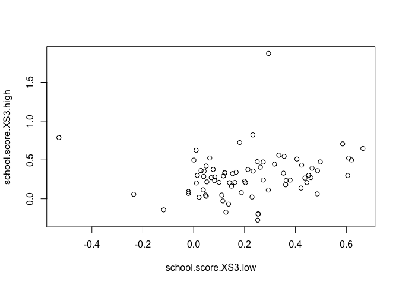<!-- -->

```r
t.test(school.score.XS3.high - school.score.XS3.low)
```

```
## 
## 	One Sample t-test
## 
## data:  school.score.XS3.high - school.score.XS3.low
## t = 2.2391, df = 75, p-value = 0.02811
## alternative hypothesis: true mean is not equal to 0
## 95 percent confidence interval:
##  0.009282804 0.159011664
## sample estimates:
##  mean of x 
## 0.08414723
```

School-wise heterogeneity


```r
hist(school.score, xlab = "School Treatment Effect Estimate", main = "")
```

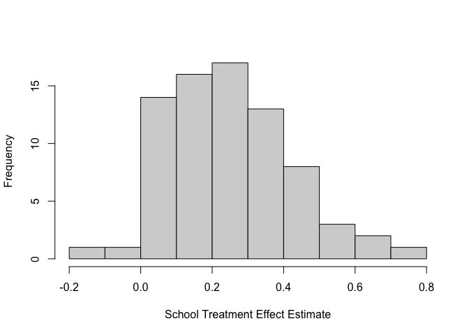<!-- -->


#### ATE sanity check


```r
ate.hat = mean(school.score)
se.hat = sqrt(var(school.score) / length(school.score - 1))
print(paste(round(ate.hat, 3), "+/-", round(1.96 * se.hat, 3)))
```

```
## [1] "0.248 +/- 0.039"
```


#### Variation in propensity scores


```r
DF = X
DF$W.hat = cf$W.hat

boxplot(W.hat ~ S3, data = DF, ylab = "Propensity Score", xlab = "Student Expectation of Success")
lines(smooth.spline(X$S3, cf$W.hat), lwd = 2, col = 4)
```

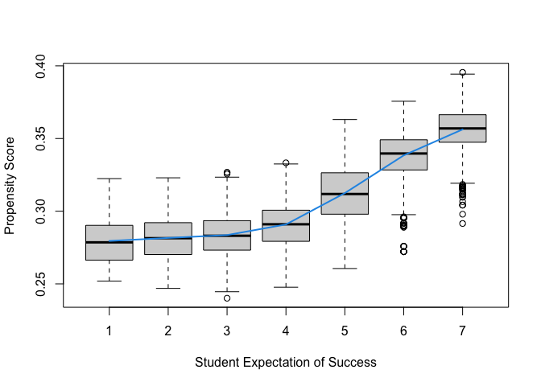<!-- -->

### 2. Robustness analyses

#### Ignor clusters


```r
cf.noclust = causal_forest(X[,selected.idx], Y, W,
                           Y.hat = Y.hat, W.hat = W.hat,
                           tune.parameters = "all")

ATE.noclust = average_treatment_effect(cf.noclust)
paste("95% CI for the ATE:", round(ATE.noclust[1], 3),
      "+/-", round(qnorm(0.975) * ATE.noclust[2], 3))
```

```
## [1] "95% CI for the ATE: 0.254 +/- 0.022"
```

```r
test_calibration(cf.noclust)
```

```
## 
## Best linear fit using forest predictions (on held-out data)
## as well as the mean forest prediction as regressors, along
## with one-sided heteroskedasticity-robust (HC3) SEs:
## 
##                                Estimate Std. Error t value    Pr(>t)    
## mean.forest.prediction         1.010882   0.044954 22.4872 < 2.2e-16 ***
## differential.forest.prediction 0.505488   0.111747  4.5235 3.075e-06 ***
## ---
## Signif. codes:  0 '***' 0.001 '**' 0.01 '*' 0.05 '.' 0.1 ' ' 1
```

```r
tau.hat.noclust = predict(cf.noclust)$predict
plot(school.id, tau.hat.noclust)
```

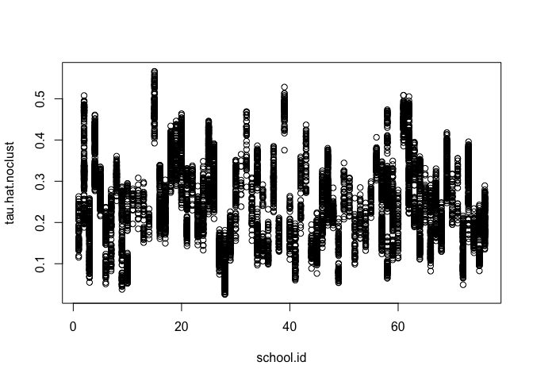<!-- -->

```r
nfold = 5
school.levels = unique(school.id)
cluster.folds = sample.int(nfold, length(school.levels), replace = TRUE)

tau.hat.crossfold = rep(NA, length(Y))
for (foldid in 1:nfold) {
  print(foldid)
  infold = school.id %in% school.levels[cluster.folds == foldid]
  cf.fold = causal_forest(X[!infold, selected.idx], Y[!infold], W[!infold],
                          Y.hat = Y.hat[!infold], W.hat = W.hat[!infold],
                          tune.parameters = "all")
  pred.fold = predict(cf.fold, X[infold, selected.idx])$predictions
  tau.hat.crossfold[infold] = pred.fold
}
```

```
## [1] 1
## [1] 2
## [1] 3
## [1] 4
## [1] 5
```

```r
cf.noclust.cpy = cf.noclust
cf.noclust.cpy$predictions = tau.hat.crossfold
cf.noclust.cpy$clusters = school.id
test_calibration(cf.noclust.cpy)
```

```
## 
## Best linear fit using forest predictions (on held-out data)
## as well as the mean forest prediction as regressors, along
## with one-sided heteroskedasticity-robust (HC3) SEs:
## 
##                                Estimate Std. Error t value Pr(>t)    
## mean.forest.prediction         1.014409   0.067388 15.0532 <2e-16 ***
## differential.forest.prediction 0.088802   0.251012  0.3538 0.3618    
## ---
## Signif. codes:  0 '***' 0.001 '**' 0.01 '*' 0.05 '.' 0.1 ' ' 1
```

```r
Rloss = mean(((Y - Y.hat) - tau.hat * (W - W.hat))^2)
Rloss.noclust = mean(((Y - Y.hat) - tau.hat.noclust * (W - W.hat))^2)
Rloss.crossfold = mean(((Y - Y.hat) - tau.hat.crossfold * (W - W.hat))^2)

c(Rloss.noclust - Rloss, Rloss.crossfold - Rloss)
```

```
## [1] 9.693719e-05 8.093755e-04
```

```r
summary(aov(dr.score ~ factor(school.id)))
```

```
##                      Df Sum Sq Mean Sq F value  Pr(>F)    
## factor(school.id)    75    201   2.686   1.985 9.6e-07 ***
## Residuals         10315  13954   1.353                    
## ---
## Signif. codes:  0 '***' 0.001 '**' 0.01 '*' 0.05 '.' 0.1 ' ' 1
```

#### Without fitting propensity score


```r
cf.noprop = causal_forest(X[,selected.idx], Y, W,
                          Y.hat = Y.hat, W.hat = mean(W),
                          tune.parameters = "all",
                          equalize.cluster.weights = TRUE,
                          clusters = school.id)
tau.hat.noprop = predict(cf.noprop)$predictions

ATE.noprop = average_treatment_effect(cf.noprop)
paste("95% CI for the ATE:", round(ATE.noprop[1], 3),
      "+/-", round(qnorm(0.975) * ATE.noprop[2], 3))
```

```
## [1] "95% CI for the ATE: 0.254 +/- 0.038"
```

```r
plot(tau.hat, tau.hat.noprop,
     xlim = range(tau.hat, tau.hat.noprop),
     ylim = range(tau.hat, tau.hat.noprop),
     xlab = "orthogonalized causal forest estimates",
     ylab = "non-orthogonalized causal forest")
abline(0, 1, lwd = 2, lty = 2, col = 4)
```

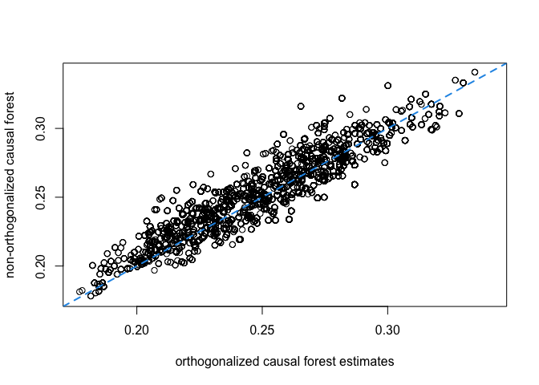<!-- -->

#### Train forest on school-wise DR scores


```r
school.X = (t(school.mat) %*% as.matrix(X[,c(4:8, 25:28)])) / school.size
school.X = data.frame(school.X)
colnames(school.X) = c("X1", "X2", "X3", "X4", "X5",
                    "XC.1", "XC.2", "XC.3", "XC.4")

dr.score = tau.hat + W / cf$W.hat * (Y - cf$Y.hat - (1 - cf$W.hat) * tau.hat) -
  (1 - W) / (1 - cf$W.hat) * (Y - cf$Y.hat + cf$W.hat * tau.hat)
school.score = t(school.mat) %*% dr.score / school.size

school.forest = regression_forest(school.X, school.score)
school.pred = predict(school.forest)$predictions
test_calibration(school.forest)
```

```
## 
## Best linear fit using forest predictions (on held-out data)
## as well as the mean forest prediction as regressors, along
## with one-sided heteroskedasticity-robust (HC3) SEs:
## 
##                                Estimate Std. Error t value Pr(>t)    
## mean.forest.prediction         1.002563   0.082046 12.2196 <2e-16 ***
## differential.forest.prediction 0.638955   0.694338  0.9202 0.1802    
## ---
## Signif. codes:  0 '***' 0.001 '**' 0.01 '*' 0.05 '.' 0.1 ' ' 1
```

#### Alternative OLS analysis


```r
school.DF = data.frame(school.X, school.score=school.score)
coeftest(lm(school.score ~ ., data = school.DF), vcov = vcovHC)
```

```
## 
## t test of coefficients:
## 
##               Estimate Std. Error t value Pr(>|t|)   
## (Intercept)  0.2458853  0.0772769  3.1819 0.002231 **
## X1          -0.0494070  0.0288857 -1.7104 0.091884 . 
## X2           0.0129607  0.0334919  0.3870 0.700017   
## X3           0.0083738  0.0261663  0.3200 0.749963   
## X4           0.0253249  0.0256710  0.9865 0.327483   
## X5          -0.0335447  0.0264725 -1.2672 0.209553   
## XC.1        -0.0063410  0.0930354 -0.0682 0.945867   
## XC.2         0.0822959  0.1050329  0.7835 0.436122   
## XC.3        -0.1373866  0.0877172 -1.5662 0.122074   
## XC.4         0.0394062  0.0822762  0.4789 0.633557   
## ---
## Signif. codes:  0 '***' 0.001 '**' 0.01 '*' 0.05 '.' 0.1 ' ' 1
```


```r
hist(tau.hat, xlab = "estimated CATE", main = "")
```

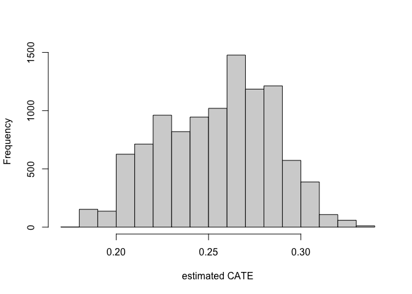<!-- -->

```r
hist(tau.hat.noprop, xlab = "estimated CATE", main = "")
```

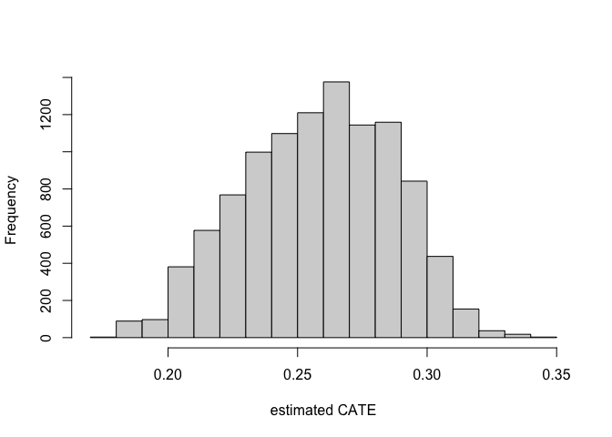<!-- -->

```r
# hist(tau.hat.noclust, xlab = "estimated CATE", main = "",
#      breaks = seq(-0.0, 0.55, by = 0.55 / 25))

boxplot(tau.hat ~ round(X$X1), xlab = "X1", ylab = "estimated CATE")
lines(smooth.spline(4 + X[,"X1"], tau.hat, df = 4), lwd = 2, col = 4)
```

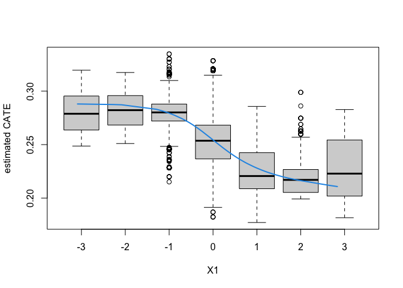<!-- -->

```r
boxplot(tau.hat ~ round(X$X2), xlab = "X2", ylab = "estimated CATE")
lines(smooth.spline(4 + X[,"X2"], tau.hat, df = 4), lwd = 2, col = 4)
```

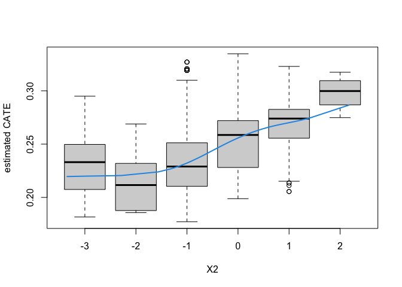<!-- -->

```r
school.avg.tauhat = t(school.mat) %*% tau.hat / school.size

plot(school.avg.tauhat, school.pred, cex = 1.5,
     xlim = range(school.avg.tauhat, school.pred),
     ylim = range(school.avg.tauhat, school.pred),
     xlab = "average CATE estimate in school",
     ylab = "school-wise forest predictions")
abline(0, 1, lwd = 2, lty = 2, col = 4)
```

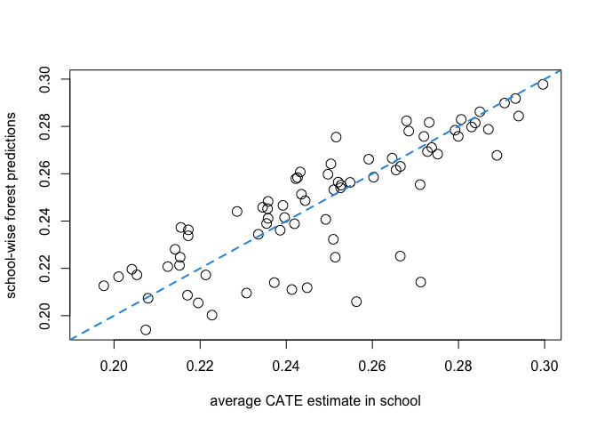<!-- -->

### 3. Experiment with no orthogonalization


```r
n.synth = 1000
p.synth = 10
X.synth = matrix(rnorm(n.synth * p.synth), n.synth, p.synth)
W.synth = rbinom(n.synth, 1, 1 / (1 + exp(-X.synth[,1])))
Y.synth = 2 * rowMeans(X.synth[,1:6]) + rnorm(n.synth)

Y.forest.synth = regression_forest(X.synth, Y.synth)
Y.hat.synth = predict(Y.forest.synth)$predictions
W.forest.synth = regression_forest(X.synth, W.synth)
W.hat.synth = predict(W.forest.synth)$predictions

cf.synth = causal_forest(X.synth, Y.synth, W.synth,
                         Y.hat = Y.hat.synth, W.hat = W.hat.synth)
ATE.synth = average_treatment_effect(cf.synth)
paste("95% CI for the ATE:", round(ATE.synth[1], 3),
      "+/-", round(qnorm(0.975) * ATE.synth[2], 3))
```

```
## [1] "95% CI for the ATE: 0.071 +/- 0.141"
```

```r
cf.synth.noprop = causal_forest(X.synth, Y.synth, W.synth,
                                Y.hat = Y.hat.synth, W.hat = mean(W.synth))
ATE.synth.noprop = average_treatment_effect(cf.synth.noprop)
paste("95% CI for the ATE:", round(ATE.synth.noprop[1], 3),
      "+/-", round(qnorm(0.975) * ATE.synth.noprop[2], 3))
```

```
## [1] "95% CI for the ATE: 0.198 +/- 0.139"
```

Visualize school-level covariates by treatment heterogeneity

```r
school.X.std = scale(school.X)
school.tercile = cut(school.pred,
                     breaks = c(-Inf, quantile(school.pred, c(1/3, 2/3)), Inf))
school.tercile.mat = model.matrix(~ school.tercile + 0)
school.means = diag(1 / colSums(school.tercile.mat)) %*% t(school.tercile.mat) %*% as.matrix(school.X.std)

MM = max(abs(school.means))
HC = heat.colors(21)
school.col = apply(school.means, 1:2, function(aa) HC[1 + round(20 * (0.5 + aa))])

DF.plot = data.frame(tercile=rep(factor(1:3, labels=c("low", "mid", "high")), 9), mean=as.numeric(school.means),
                     feature = factor(rbind(colnames(school.X), colnames(school.X), colnames(school.X))))

ggplot(data = DF.plot, aes(x = feature, y = tercile, fill = mean)) +
    geom_tile() + scale_fill_gradient(low = "white", high = "steelblue") +
    theme(axis.text = element_text(size=12), axis.title = element_text(size=14),
          legend.title = element_text(size=14), legend.text = element_text(size=12)) +
    theme(panel.background = element_blank())
```

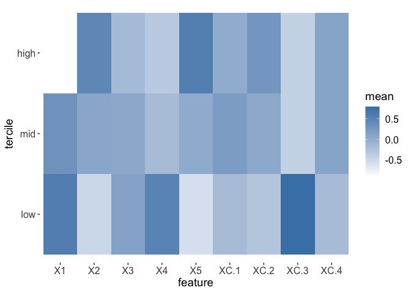<!-- -->

```r
mean(school.X$XC.3)
```

```
## [1] 0.2105263
```

```r
mean(school.X$XC.3[as.numeric(school.tercile) == 1])
```

```
## [1] 0.5384615
```

CATE by school


```r
ord = order(order(school.pred))
school.sort = ord[school.id]

boxplot(tau.hat.noclust ~ school.sort, xaxt = "n",
        xlab = "school", ylab = "estimated CATE")
points(1:76, sort(school.pred), col = 4, pch = 16)
legend("topleft", c("school mean CATE", "CATE w/o clustering"), pch = c(16, 1), col = c(4, 1), cex = 1.5)
```

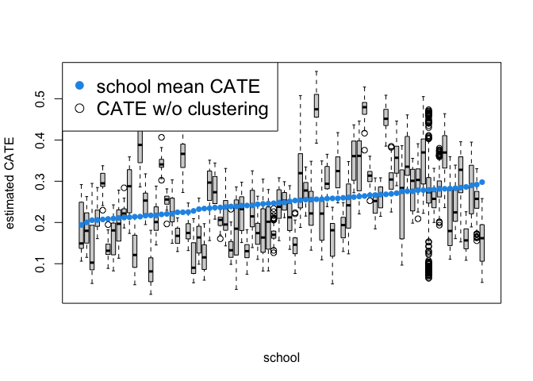<!-- -->


Note:
setting `equalize.cluster.weights` to TRUE means each school receives equal weight in ATE estimation

